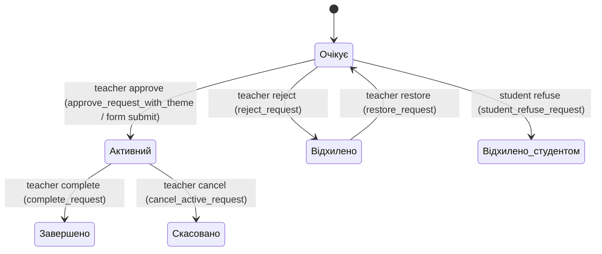

# Advisor Finder (Django-проєкт) 

Цей README описує, як влаштований і як експлуатується Django-проєкт, які сценарії підтримує застосунок, та які проблеми вже зафіксовані в логах/коді з пропонованим планом виправлень.

Документ орієнтований на технічну команду: розробка, дебаг, реліз та підтримка.

## Зміст

1. [Огляд](#огляд)
2. [Стек і архітектура](#стек-і-архітектура)
3. [Структура репозиторію (ключові місця)](#структура-репозиторію-ключові-місця)
4. [Швидкий старт (Docker Compose)](#швидкий-старт-docker-compose)
5. [Конфігурація середовища](#конфігурація-середовища)
6. [URL-роутинг і модулі застосунку](#url-роутинг-і-модулі-застосунку)
7. [Доменні сутності та дані](#доменні-сутності-та-дані)
8. [Сценарії користувачів](#сценарії-користувачів)
9. [WebSocket / нотифікації (Channels)](#websocket--нотифікації-channels)
10. [Файли та зберігання медіа](#файли-та-зберігання-медіа)
11. [Безпека та налаштування](#безпека-та-налаштування)
12. [Evidence pack: поточні неполадки](#evidence-pack-поточні-неполадки)
13. [План виправлень (без коду, тільки рекомендації)](#план-виправлень-без-коду-только-рекомендації)
14. [Як тестувати після виправлень](#як-тестувати-після-виправлень)

---

## Огляд

Це веб-застосунок для взаємодії між:

- `Студентами` (подають запити на теми робіт)
- `Викладачами` (мають кафедру/профіль, створюють теми, підтверджують/відхиляють запити, перевіряють роботи)

Ключова бізнес-логіка реалізована через Django-моделі `Request` / `TeacherTheme` / `StudentTheme`, а також через HTML/HTMX інтерфейси каталогу викладачів і профілі.

Додатково підтримуються:

- оновлення статусів та подій через WebSocket (Channels) у групах користувачів
- сповіщення (email + websocket) через Django model signals
- робота з файлами запитів та коментарями до файлів
- семестрові дедлайни/блокування через модель `Semestr` та правила в `apps/catalog/semestr_rules.py`

---

## Стек і архітектура

Основні технології:

- Django 5.1.x
- Django REST Framework (частково для API/JSON відповіді)
- MySQL (движок БД)
- Channels + Daphne (під WebSocket)
- HTMX (частково для модальних форм і часткових оновлень)
- Nginx як reverse-proxy для `web`
- WhiteNoise для статичних файлів у продакшн-подібних сценаріях
- Зберігання медіа (локальне або через Azure Blob / Cloudinary через `STORAGES`)

Асинхронність:

- WebSocket працює через `ASGI`-конфіг (`project/project/project/asgi.py`), який маршрутизує `http` до стандартного Django application, а `websocket` — до URLRouter у `apps/notifications/routing.py`.

---

## Структура репозиторію (ключові місця)

Наведені нижче шляхи вказують на найважливіші місця в коді/конфігурації.

### Django core

- Налаштування: [`project/project/project/settings.py`](project/settings.py)
- URL-роутинг (root): [`project/project/project/urls.py`](project/urls.py)
- ASGI (Channels): [`project/project/project/asgi.py`](project/asgi.py)

### Модулі застосунку

- `apps/users`:
  - Сутності користувачів: [`project/project/apps/users/models.py`](apps/users/models.py)
  - Ендпоінти авторизації/профілю: [`project/project/apps/users/views.py`](apps/users/views.py)
  - URL конфіг: [`project/project/apps/users/urls.py`](apps/users/urls.py)
- `apps/catalog`:
  - Сутності домену: [`project/project/apps/catalog/models.py`](apps/catalog/models.py)
  - Роутинг: [`project/project/apps/catalog/urls.py`](apps/catalog/urls.py)
  - В’юхи: [`project/project/apps/catalog/views.py`](apps/catalog/views.py)
  - Міксини доступу: [`project/project/apps/catalog/utils.py`](apps/catalog/utils.py)
  - Семестрові правила: [`project/project/apps/catalog/semestr_rules.py`](apps/catalog/semestr_rules.py)
- `apps/notifications`:
  - Моделі повідомлень: [`project/project/apps/notifications/models.py`](apps/notifications/models.py)
  - WebSocket consumer: [`project/project/apps/notifications/consumer.py`](apps/notifications/consumer.py)
  - WebSocket routing: [`project/project/apps/notifications/routing.py`](apps/notifications/routing.py)
  - Signals (тригери нотифікацій): [`project/project/apps/notifications/signals.py`](apps/notifications/signals.py)
  - Web/JSON views: [`project/project/apps/notifications/views.py`](apps/notifications/views.py)

### Шаблони (HTML)

Найчастіше використовуються:

- Логін/реєстрація:
  - [`project/project/templates/auth/login.html`](templates/auth/login.html)
  - [`project/project/templates/auth/register.html`](templates/auth/register.html)
- Головна сторінка:
  - [`project/project/templates/home.html`](templates/home.html)
- Профілі та профільні вкладки:
  - [`project/project/templates/profile/profile.html`](templates/profile/profile.html)
  - [`project/project/templates/profile/active.html`](templates/profile/active.html)
  - [`project/project/templates/profile/archive.html`](templates/profile/archive.html)
  - [`project/project/templates/profile/student_edit.html`](templates/profile/student_edit.html)
  - [`project/project/templates/profile/teacher_edit.html`](templates/profile/teacher_edit.html)
  - [`project/project/templates/profile/requests.html`](templates/profile/requests.html)
- Каталог викладачів і HTMX модальне вікно:
  - [`project/project/templates/catalog/base.html`](templates/catalog/base.html)
  - [`project/project/templates/catalog/teachers_catalog.html`](templates/catalog/teachers_catalog.html)
  - [`project/project/templates/catalog/teacher_cards.html`](templates/catalog/teacher_cards.html)
  - [`project/project/templates/catalog/teacher_modal.html`](templates/catalog/teacher_modal.html)
- Нотифікації:
  - [`project/project/templates/notifications/notification.html`](templates/notifications/notification.html)
  - [`project/project/templates/notifications/new_request.html`](templates/notifications/new_request.html)
  - [`project/project/templates/notifications/new_file.html`](templates/notifications/new_file.html)
  - [`project/project/templates/notifications/request_status_changed.html`](templates/notifications/request_status_changed.html)
  - [`project/project/templates/notifications/work_status_changed.html`](templates/notifications/work_status_changed.html)

### Інфраструктура (Docker / Nginx / деплой)

Ці файли лежать на рівні `project/` (поруч із ними є `Dockerfile` і `docker-compose.yml`):

- Dockerfile: [`project/Dockerfile`](../Dockerfile)
- docker-compose: [`project/docker-compose.yml`](../docker-compose.yml)
- Nginx конфіг (proxy + static/media alias): [`project/nginx.conf`](../nginx.conf)
- Ініціалізація MySQL: [`project/mysql-init/init.sql`](../mysql-init/init.sql)
- Скрипти (для деплою/cron/пошти):
  - [`project/cronjob.sh`](../cronjob.sh)
  - [`project/deploy.sh`](../deploy.sh)
  - [`project/setup_postfix.sh`](../setup_postfix.sh)

> Примітка: у цьому репозиторії git-метадані відсутні на рівні кореня, тому “cron/deploy” виглядають як зовнішні скрипти для сервера.

---

## Швидкий старт (Docker Compose)

Найпростіший спосіб підняти сервіс локально — використати `docker-compose.yml` (в теці `project/`).

1. Перейдіть у теку з `docker-compose.yml`:
   - `cd project`
2. Переконайтесь, що файл `.env` існує і заповнений:
   - змінні потрібні для MySQL і OAuth/Cloudinary/Azure
3. Побудуйте та підніміть контейнери:
   - `docker compose up --build`
4. Далі доступні порти:
   - Nginx: `http://localhost/`
   - MySQL: `localhost:3307`

Очікувана послідовність старту визначена через `depends_on: condition: service_healthy` для `db`.

---

## Конфігурація середовища

Ключові змінні оточення (мають бути в `.env` поруч з `docker-compose.yml`):

- База даних:
  - `DB_NAME`, `DB_HOST`, `DB_PORT`
  - `DB_USER`, `DB_PASSWORD`, `DB_ROOT_PASSWORD`
- Microsoft OAuth:
  - `MICROSOFT_CLIENT_ID`, `MICROSOFT_CLIENT_SECRET`
  - `MICROSOFT_TENANT_ID`
  - `MICROSOFT_REDIRECT_URI`
- Зберігання файлів:
  - `CLOUDINARY_URL` (якщо використовується Cloudinary)
  - `AZURE_ACCOUNT_NAME`, `AZURE_ACCOUNT_KEY`, `AZURE_CONTAINER` (якщо використовується Azure Blob)
  - `USE_LOCAL_MEDIA` (якщо виставлено `true`, то fallback до локального зберігання)
- Додатково:
  - `SHOW_FAKE_USERS` (для фейкових сценаріїв логіну)
  - `BASE_URL`, `SITE_URL` (впливають на абсолютні URL у нотифікаціях)

> У документації **не наводяться значення секретів**. Використовуйте ваш поточний `.env`.

---

## URL-роутинг і модулі застосунку

Root `project/urls.py` монтує модулі:

- `admin/`
- `import-teachers-excel/`, `import-students-excel/`, `import-themes-excel/` (admin-імпорт)
- `''` (головна сторінка): `apps.catalog.views.home`
- `users/` (всі користувацькі URL): `apps.users.urls`
- `catalog/` (каталог викладачів, теми, файли): `apps.catalog.urls`
- `notifications/` (список повідомлень): `apps.notifications.urls`

### `apps/users/urls.py` (найважливіші маршрути)

Повний список `users/` routes:

- `users/register/` -> `views.microsoft_register` (Microsoft OAuth реєстрація)
- `users/login/` -> `views.microsoft_login` (Microsoft OAuth вхід)
- `users/fake_login/` -> `views.fake_login` (тестовий вхід викладача)
- `users/fake_student_login/` -> `views.fake_student_login` (тестовий вхід студента)
- `users/fake_student_login_2/` -> `views.fake_student_login_2` (тестовий вхід студента)
- `users/callback` -> `views.microsoft_callback` (OAuth callback; `state` містить `action=register|login`)
- `users/profile/` -> `views.profile` (профіль поточного користувача)
- `users/profile/<int:user_id>/` -> `views.profile` (профіль “чужого” користувача)
- `users/logout/` -> `views.logout_view`
- `users/reject_request/<int:request_id>/` -> `views.reject_request`
- `users/restore_request/<int:request_id>/` -> `views.restore_request`
- `users/update-profile-picture/` -> `views.update_profile_picture`
- `users/crop-profile-picture/` -> `views.crop_profile_picture`
- `users/teacher/profile/edit/` -> `views.teacher_profile_edit`
- `users/student/profile/edit/` -> `views.student_profile_edit`
- `users/complete_request/<int:request_id>/` -> `views.complete_request`
- `users/profile/load-tab/<str:tab_name>/` -> `views.load_profile_tab` (AJAX load вкладок)
- `users/archived-request-details/<int:request_id>/` -> `views.archived_request_details`
- `users/request-files/<int:request_id>/` -> `views.request_files_for_completion`
- `users/request-details-for-approve/<int:request_id>/` -> `views.request_details_for_approve`
- `users/approve-request-with-theme/<int:request_id>/` -> `views.approve_request_with_theme`
- `users/student-refuse-request/<int:request_id>/` -> `views.student_refuse_request`
- `users/edit-request-theme/<int:request_id>/` -> `views.edit_request_theme`
- `users/get-student-request-details/<int:request_id>/` -> `views.get_student_request_details`
- `users/edit-student-request/<int:request_id>/` -> `views.edit_student_request`
- `users/teacher-theme/create/` -> `views.create_teacher_theme`
- `users/teacher-theme/deactivate/<int:theme_id>/` -> `views.deactivate_teacher_theme`
- `users/teacher-theme/activate/<int:theme_id>/` -> `views.activate_teacher_theme`
- `users/teacher-theme/delete/<int:theme_id>/` -> `views.delete_teacher_theme`
- `users/teacher-theme/attach-streams/<int:theme_id>/` -> `views.attach_theme_to_streams`
- `users/teacher-theme/update/<int:theme_id>/` -> `views.update_teacher_theme`
- `users/cancel-request/<int:request_id>/` -> `views.cancel_active_request`

### `apps/catalog/urls.py` (каталог і операції)

Повний список `catalog/` routes:

- `catalog/` -> `TeachersCatalogView` (сторінка каталогу)
- `catalog/teachers/` -> `TeachersListView` (JSON список викладачів + доступність)
- `catalog/teacher/<int:pk>/` -> `TeacherModalView` (HTMX-модальне вікно)
- `catalog/complete-request/<int:pk>/` -> `CompleteRequestView` (завершення; JSON/AJAX)
- `catalog/reject-request/<int:request_id>/` -> `reject_request`
- `catalog/load-tab/<str:tab_name>/` -> `load_tab_content` (load контенту вкладок)
- `catalog/request/<int:request_id>/upload-file/` -> `UploadFileView`
- `catalog/file/<int:pk>/delete/` -> `DeleteFileView`
- `catalog/file/<int:pk>/download/` -> `DownloadFileView`
- `catalog/file/<int:file_id>/comment/` -> `add_comment`
- `catalog/comment/<int:pk>/delete/` -> `DeleteCommentView`
- `catalog/autocomplete/` -> `AutocompleteView` (пошук)
- `catalog/themes/` -> `ThemesAPIView` (API JSON)
- `catalog/themes/list/` -> `ThemesListView`
- `catalog/themes/all/` -> `ThemesListView`
- `catalog/autocomplete/theme/<int:theme_id>/teachers/` -> `ThemeTeachersView`

### `apps/notifications/urls.py`

- `notifications/get_messages/` — список повідомлень поточного користувача (LoginRequired)
- `notifications/read/<message_id>/` — позначення повідомлення прочитаним (csrf_exempt, без login_required)

---

## Доменні сутності та дані

Умовно домен можна поділити на 5 блоків:

1. Користувачі та профілі
2. Каталог викладачів (профіль викладача) та теми
3. Потоки/групи/кафедри/факультети (нормалізована структура)
4. Запити та файли/коментарі
5. Семестрові правила (дедлайни та блокування)

### `users.CustomUser`

Визначено кастомного користувача з ролями:

- `role`: `'Студент'` або `'Викладач'`
- `email` (унікальний)
- `academic_group` (для студентів)
- `profile_picture` (ImageField)
- `patronymic`

Пов’язані методи:

- `get_profile()` — повертає OneToOne профіль (`OnlyTeacher` або `OnlyStudent`)
- `get_department()` — повертає `Department`:
  - для студентів — через активний запит
  - для викладача — через профіль викладача

### `catalog.OnlyTeacher`

Ключові поля:

- `teacher_id`: OneToOne до `users.CustomUser` (primary_key)
- `academic_level` (місце/позиція викладача у UI)
- `additional_email`, `phone_number`
- `profile_link`
- `department` (FK на `Department`, null allowed)

Створення OneToOne профілю:

- сигнал `post_save` на `CustomUser`:
  - якщо створено користувача з роллю `'Викладач'` — викликається `OnlyTeacher.objects.get_or_create(teacher_id=instance)`

### `catalog.OnlyStudent` (нормалізована структура)

Поля:

- `student_id`: OneToOne на `CustomUser`
- `group`: FK на `Group`
- `department`: FK на `Department`
- `faculty`: FK на `Faculty`
- `additional_email`, `phone_number`

Похідні властивості:

- `specialty`, `education_level`, `course` — через зв’язки `group -> stream -> specialty`

### `catalog.Stream`, `catalog.Group`, `catalog.Specialty`, `catalog.Faculty`, `catalog.Department`

Ці моделі формують ієрархію:

- `Faculty` -> `Specialty` -> `Stream` -> `Group`
- `Department` належить `Faculty`

### Теми

#### `catalog.TeacherTheme`

Поля:

- `teacher_id` -> `OnlyTeacher`
- `theme`, `theme_description`
- `is_occupied` (чи є тема вже в активних/очікуваних запитах)
- `is_active`, `is_deleted`
- `streams` (ManyToMany на `Stream`)

Має бізнес-методи:

- `can_be_deleted()`, `soft_delete()`, `activate()`, `deactivate()`, `get_streams_display()`

#### `catalog.StudentTheme`

Зберігає фактичну тему студента:

- `student_id` -> `CustomUser`
- `request` -> `Request`
- `theme`

### Запити та файли

#### `catalog.Request`

Суть:

- студент подає запит на роботу до конкретного викладача та/або слота

Ключові поля:

- `student_id` (FK на CustomUser, limit_choices_to role `'Студент'`)
- `teacher_id` (FK на OnlyTeacher)
- `slot` (FK на Slot, може бути `null`)
- `teacher_theme` (FK на TeacherTheme)
- `approved_student_theme` / `custom_student_theme`
- `request_status`: `'Очікує'`, `'Активний'`, `'Відхилено'`, `'Завершено'`
- `academic_year`, `work_type`, `motivation_text`

### `catalog.RequestFile` та `catalog.FileComment`

`RequestFile`:

- зберігає завантажений файл у `request_files/%Y/%m/%d/`
- має `version` і прапорець `is_archived`
- підтримує `uploaded_by`, `uploaded_at`, `description`

`FileComment`:

- коментарі до конкретного файлу
- можливість вкладеності через `parent`
- додатковий файл коментаря через `attachment`

---

### Машина станів `Request` (`request_status`)

`request_status` керує тим, хто і які дії може виконати над запитом, а також які елементи показуються у профілях (`users/profile/...`) і які нотифікації відправляються.

У моделі `catalog.models.Request` у `STATUS` закладені базові значення: `Очікує`, `Активний`, `Відхилено`, `Завершено`. Проте у в’юхах фактично використовуються додаткові значення:

- `Відхилено студентом` (в коді з’являється у `student_refuse_request`)
- `Скасовано` (в коді з’являється у `cancel_active_request`)

Тобто є потенційна невідповідність “choices в моделі” ↔ “реальні значення в коді”. Це варто врахувати під час виправлень і тестування (особливо якщо десь є валідація по choices).

#### Основні переходи (high level)

#### Які ендпоінти/функції що встановлюють

- Створення запиту:
  - `TeacherModalView.form_valid()` / `assign_request_fields()` у `apps/catalog/views.py` встановлює `request_status = "Очікує"`.
- Підтвердження викладачем:
  - `approve_request_with_theme()` у `apps/users/views.py` встановлює `req.request_status = "Активний"` і (якщо потрібно) знімає зайнятість тем у “конкуруючих” очікуючих запитах того самого студента.
- Відхилення викладачем:
  - `reject_request()` у `apps/users/views.py` встановлює `req.request_status = "Відхилено"` і звільняє `TeacherTheme`, якщо він прив’язаний до запиту.
- Відмова студента:
  - `student_refuse_request()` у `apps/users/views.py` (decorators: `@csrf_exempt`, `@require_POST`, `@transaction.atomic`) встановлює `req.request_status = "Відхилено студентом"`, очищає `TeacherTheme.is_occupied` та записує `rejected_reason`.
- Завершення роботи викладачем:
  - `complete_request()` у `apps/users/views.py` встановлює `req.request_status = "Завершено"`, проставляє `grade` і `completion_date`, а також архівує файли через `RequestFile.is_archived = True`.
- Скасування викладачем:
  - `cancel_active_request()` у `apps/users/views.py` встановлює `req.request_status = "Скасовано"`, проставляє `completion_date` та звільняє `TeacherTheme`.
- Відновлення відхиленого запиту:
  - `restore_request()` у `apps/users/views.py` повертає `request_status` назад до `"Очікує"` (з валідацією, що студент не має активного запиту/не має іншого “в обробці”).

#### Як ці стани використовуються в UI і нотифікаціях

- Профіль (побудова вкладок):
  - `load_profile_tab()` у `apps/users/views.py` фільтрує запити для викладача по `request_status__in=["Очікує","Відхилено"]` та `request_status__in=["Активний","Завершено"]`.
- Архів:
  - для “archive” використовуються `request_status="Завершено"` і `files__is_archived=True`.
- WebSocket/Signals:
  - у `apps/notifications/signals.py` статусні нотифікації відсилаються не для всіх станів (у логіці `send_notification_on_request_status_changed` особливо враховуються `Завершено` і `Відхилено студентом`).

---

## Сценарії користувачів

Нижче описано найважливіші use-cases з погляду ролей.

### Реєстрація / вхід через Microsoft OAuth

Роутинг:

- `users/register/` -> `microsoft_register`
- `users/login/` -> `microsoft_login`
- `users/callback` -> `microsoft_callback`

Обробка:

- `microsoft_register` зберігає `role`, `group`, `department_id` у `session`, формує URL OAuth з `state`
- `microsoft_callback`:
  - перевіряє CSRF у `state` (порівняння `request.session['csrf_state']` і received)
  - делегує у `handle_registration_callback` або `handle_login_callback`
- `handle_registration_callback`:
  - отримує access token + user info через Microsoft Graph
  - визначає `derived_role` на основі job title
  - перевіряє, чи підходить факультет (через `validate_faculty_from_microsoft`)
  - створює `CustomUser` і профіль:
    - для студентів: створення `OnlyStudent` (через helpers у `registration_services`)
    - для викладачів: створення `OnlyTeacher` профілю (через helpers)
- `handle_login_callback`:
  - перевіряє факультет для нових користувачів
  - логінить користувача через `auth_login` і редіректить на `profile`

Додатково існують “фейкові” логіни для відлагодження:

- `fake_login`, `fake_student_login`, `fake_student_login_2`

### Каталог викладачів і подача запиту (HTMX)

Потік:

1. Студент відкриває `catalog/`
2. Список викладачів підтягується через `catalog/teachers/`
3. Натискання на викладача відкриває модальне вікно `catalog/teacher/<pk>/` (`TeacherModalView`)
4. Форма підписується на submit:
   - у шаблоні `templates/catalog/teacher_modal.html` є `data-action-url=""`
   - на сервері `TeacherModalView.form_valid()` створює `Request`, призначає `teacher_theme` та (опційно) `StudentTheme` і повертає JSON/HTMX редірект

Ключова точка прав доступу для модального вікна:

- використовується `HtmxModalFormAccessMixin` (див. секцію про 403 у evidence pack)

### Робота із профілем та запитами

Одна сторінка `users/profile/` містить різний контент залежно від `role`:

- викладач бачить: активні/очікувані/відхилені запити, теми, слоти
- студент бачить: власні запити по статусах, активні/архівні дані, файли та коментарі

Перехід між діями над запитами виконується через набір endpoints у `users/urls.py` та `catalog/urls.py`.

---

## WebSocket / нотифікації (Channels)

### 1) ASGI та routing

ASGI конфіг:

- [`project/project/project/asgi.py`](project/asgi.py)

Мапінг:

- `http`: стандартний Django
- `websocket`: `AllowedHostsOriginValidator(AuthMiddlewareStack(URLRouter(apps.notifications.routing.websocket_urlpatterns)))`

WebSocket URL:

- [`project/project/apps/notifications/routing.py`](apps/notifications/routing.py)
  - `ws/notifications/` -> `NotificationsConsumer`

### 2) Групи

Consumer використовує групу:

- `group_name = f'user_{self.user.id}'`

Це напряму відповідає утиліті `get_group_name(user_id)`:

- [`project/project/apps/notifications/utils.py`](apps/notifications/utils.py)

### 3) Коли надсилаються нотифікації

Сигнали:

- при створенні нового `Request`: [`project/project/apps/notifications/signals.py`](apps/notifications/signals.py)
- при завантаженні `RequestFile`: той самий файл
- при зміні статусу запиту (pre_save Request)
- при зміні оцінки/grade (pre_save Request)
- при створенні `FileComment`

Нотифікації формуються через:

- `Message.objects.create(...)`
- email відправка в треді (`send_email_in_thread`)
- websocket group_send:
  - `async_to_sync(channel_layer.group_send)(group_name, event)`

Consumer робить:

- рендер HTML шаблону `notifications/notification.html`
- відправляє `text_data` у websocket

---

## Файли та зберігання медіа

Завантаження та віддача файлів відбувається через моделі:

- `catalog.RequestFile` (`FileField` для основного файлу)
- `catalog.FileComment.attachment` (`FileField` для вкладення коментаря)

Віддача файлу:

- `catalog/file/<pk>/download/` -> `DownloadFileView`, який перевіряє права, після чого віддає `FileResponse(file.file)`

Архівування:

- `RequestFile.is_archived` (логіка переміщення архів/неархів у в’юхах)

Зберігання медіа:

- у settings підтримується перемикання `STORAGES` між:
  - локальним `FileSystemStorage`
  - Azure Blob Storage backend
- Cloudinary:
  - опційно конфігурується через `CLOUDINARY_URL`

---

## Безпека та налаштування

Цей розділ важливий, оскільки в evidence pack є конкретні знахідки.

У `settings.py`:

- `SECRET_KEY` — жорстко закодований
- `DEBUG = False`, але в коментарі вказано, що “root cause” file upload issues пов’язують з цим режимом
- `ALLOWED_HOSTS` містить `'*'` для тимчасового тестування
- `SESSION_COOKIE_SECURE = True` і `CSRF_COOKIE_SECURE = True` (це може впливати на локальні сценарії через відсутність HTTPS)
- CORS:
  - `CORS_ALLOW_ALL_ORIGINS = True`
  - `CORS_ALLOW_CREDENTIALS = True`
  - `CORS_ALLOWED_ORIGINS` заданий, але у присутності allow-all це може породжувати неочікувану поведінку

WebSocket:

- `CHANNEL_LAYERS` налаштовано на `channels.layers.InMemoryChannelLayer` (ризики для продакшн; треба Redis або інший shared backend)

---

## Evidence pack: поточні неполадки

Нижче зібрані проблеми, які зафіксовані в `project/project/django_info.log` або випливають із поведінки коду/налаштувань. Для кожної проблеми є:

- симптом (що бачимо)
- доказ (з логів/коду)
- де це знаходиться в коді
- коротка гіпотеза першопричини

> Важливо: лог `django_info.log` містить події імовірно з конкретної версії коду/схеми БД. Якщо код змінювався після логування, то частина проблем може бути “історичною”. Але для плану виправлень ми все одно врахуємо ці розриви.

### 1) Database error: `Unknown column catalog_onlyteacher.position`

Симптом:

- помилки Django типу `ProgrammingError (1054)` і 500 відповіді на сторінках, зокрема `/users/profile/`

Доказ:

- фрагмент у `django_info.log`:
  - `Unknown column 'catalog_onlyteacher.position' in 'field list'`

Де в коді проявляється очікування поля “позиція/position”:

- `project/project/apps/users/views.py`:
  - у `teacher_profile_edit` використовується створення/оновлення `OnlyTeacher` через `defaults={"position": "...", ...}`
- `project/project/apps/catalog/forms.py` має документацію (docstring) про поле `positions`, яке асоціюється з `OnlyTeacher.position`

Очікуване протиріччя:

- у поточному `project/project/apps/catalog/models.py` поле `OnlyTeacher.position` **не визначено**; натомість є `academic_level`.
- Це означає можливу невідповідність:
  - між реальною схемою MySQL (колонка `position` відсутня/присутня),
  - між поточною версією коду,
  - між застосованими міграціями.

Гіпотеза:

- колись була назва поля `position`, потім перейменували/рефакторили в `academic_level`, але база або міграції залишилися неузгодженими.

### 2) 403 Forbidden на HTMX модалі запиту: `/catalog/modal/<pk>/`

Симптом:

- логування фіксує `Forbidden: /catalog/modal/2/ HTTP/1.1" 403`

Доказ у коді:

- URL:
  - `catalog/teacher/<int:pk>/` -> `TeacherModalView` (`project/project/apps/catalog/urls.py`)
- `TeacherModalView` використовує міксин:
  - `HtmxModalFormAccessMixin` у `project/project/apps/catalog/views.py`
- `HtmxModalFormAccessMixin` у `project/project/apps/catalog/utils.py`:
  - блокує доступ, якщо:
    - студент уже має запис у статусі `'Активний'`
    - або якщо запит на цей же `teacher_id` вже існує зі статусом `'Очікує'`
    - або якщо користувач не автентифікований
    - або якщо роль користувача `'Викладач'`

Критична деталь:

- у міксині `raise_exception = True`, а в `handle_no_permission`:
  - `if self.raise_exception or self.request.htmx: return HttpResponse(status=403)`
  - тобто **403 буде повертатися гарантовано**, навіть якщо request не є HTMX (бо `raise_exception=True`).

Гіпотеза:

- 403 — не обов’язково “помилка”, може бути запланованою політикою доступу (неможливо подавати новий запит при активному, або повторно запитувати того самого викладача).
- але якщо UX очікує redirect/відповідь іншого типу, то логіка `raise_exception=True` може бути невірною для non-HTMX сценаріїв.

### 3) 404 на `/` і `favicon.ico`

Симптом:

- у логах є `Not Found: /` (404) та `Not Found: /favicon.ico`

Очевидна перевірка:

- у `project/project/project/urls.py` є маршрут `path('', views.home, name='home')`, тобто root має бути змонтований.
- `home()` визначений у `project/project/apps/catalog/views.py` і повертає `render(request, "home.html", context)`.

Тоді чому 404?

- ймовірно, це:
  - або запис логів із версії, де маршрут не існував,
  - або невірний reverse-proxy/контекст (наприклад, nginx підключений до іншого upstream чи іншої конфігурації),
  - або проблема в продакшн з ALLOWED_HOSTS/проксі, що призводить до “іншого” хосту/роутера.

`favicon.ico`:

- 404 для favicon.ico — типова ситуація, якщо файл не додано в статичні активи або не налаштований fallback.

### 4) Безпека/конфіг: hardcoded `SECRET_KEY`, prints, wildcard в `ALLOWED_HOSTS`

Докази у `project/project/project/settings.py`:

- `SECRET_KEY` жорстко заданий
- є `print("DB_HOST:", ...)` і аналогічні prints для секретів/конекту
- `ALLOWED_HOSTS` містить `'*'` для “temporarily add wildcard”

Гіпотеза наслідків:

- у логах/збірі телеметрії можуть витікати значення середовищ
- небажано давати wildcard в `ALLOWED_HOSTS` у продакшн

### 5) Cookies + CSRF + локальні сценарії (ймовірно пов’язано з 403/файловими проблемами)

Докази в `settings.py`:

- `SESSION_COOKIE_SECURE = True`
- `CSRF_COOKIE_SECURE = True`
- `DEBUG = False` (і є коментар, що “root cause” file upload issues — у DEBUG/боці продакшн)

Гіпотеза:

- при запуску на HTTP (локально або в dev без TLS) secure cookies можуть не надсилатися браузером.
- це може давати 403 на POST/CSRF-валідації, або ламати логіку завантажень/форм.

### 6) WebSocket: InMemory channel layer

Докази:

- `CHANNEL_LAYERS = {"default": {"BACKEND": "channels.layers.InMemoryChannelLayer"}}` у `settings.py`

Гіпотеза:

- InMemory працює для dev або одиночного процесу; у продакшн при кількох worker/pod події не розсилаються між інстансами.

### 7) `MarkAsReadView`: csrf_exempt і відсутність вимоги логіну

Доказ:

- `project/project/apps/notifications/views.py`:
  - `@method_decorator(csrf_exempt, name='dispatch')`
  - немає `LoginRequiredMixin` або декоратора `login_required`
  - `get_object_or_404(Message, id=..., recipient=request.user)` — при анонімному користувачі це може повертати 404 замість явного 403.

Ризик:

- це може створити вектор для небажаних POST-запитів (хоча доступ все одно обмежується `recipient=request.user` через get_object_or_404).

### 8) Невідповідність значень `request_status`: `choices` в моделі vs реальні значення у коді

Симптом (потенційний):

- частина UI-фільтрів та логіки нотифікацій може “не бачити” запити зі статусами, які не входять у `catalog.models.Request.STATUS`.
- виникає ризик різної семантики: у коді з’являються “суб-статуси” (`Відхилено студентом`, `Скасовано`), які можуть бути відсутні/неузгоджені у choice-списку моделі.

Доказ:

- `catalog.models.Request` визначає `STATUS` зі значеннями: `Очікує`, `Активний`, `Відхилено`, `Завершено`.
- `apps/users/views.py` встановлює додаткові значення:
  - `req.request_status = "Відхилено студентом"` у `student_refuse_request()`
  - `req.request_status = "Скасовано"` у `cancel_active_request()`
- `apps/notifications/signals.py` у логіці відправки статусних нотифікацій враховує винятки для `instance.request_status != 'Відхилено студентом'` та `instance.request_status != 'Завершено'`.

Гіпотеза:

- поле `request_status` було розширено в коді (додали уточнюючі значення), але `STATUS` choices у моделі залишилися неповністю узгодженими.

---

## План виправлень (без коду, тільки рекомендації)

Цей розділ — набір конкретних кроків, що потрібно перевірити/виправити. Він не змінює код, лише дає “what/why/how to verify”.

### A) Вирівняти схему MySQL та модель `OnlyTeacher` (позиція/academic_level)

Проблема:

- за логом очікується `OnlyTeacher.position`, але у поточній моделі є `academic_level`.
- це створює розрив в ORM/БД/міграціях.

Рекомендований план:

1. Зафіксувати фактичні поля моделі (у середовищі, де відтворюється помилка):
   - виконати `manage.py shell` і вивести поля `OnlyTeacher._meta.get_fields()`
2. Перевірити реальні колонки в MySQL:
   - `SHOW COLUMNS FROM catalog_onlyteacher;`
3. Визначити цільову схему:
   - або повернути поле `position` (як alias/синонім `academic_level`)
   - або повністю перейти на `academic_level` і прибрати будь-які залишки `position` з кодової бази/шаблонів.
4. Далі обрати один напрям:
   - Якщо ціль — `academic_level`:
     - знайти всі місця, де присутнє слово `position` (включно з defaults у `apps/users/views.py`)
     - створити міграцію, яка:
       - перейменує колонку `position` -> `academic_level` або
       - додає/мапить `academic_level` і заповнює існуючі дані
       - і видаляє `position` (якщо потрібно після переносу)
   - Якщо ціль — `position`:
     - додати поле назад у `OnlyTeacher` (і міграцією привести БД до очікувань)
5. Запустити `python manage.py makemigrations` / `migrate` у середовищі відтворення проблеми.
6. Перевірити, що 500 на профіль зник і сторінка `users/profile/` повертає 200.

Місця, які потрібно звірити:

- `project/project/apps/users/views.py` (`teacher_profile_edit` defaults)
- `project/project/apps/catalog/models.py` (`OnlyTeacher`)
- `project/project/apps/catalog/forms.py` (залишкові очікування позиції)
- міграції в `project/project/apps/catalog/migrations/`

### B) Уточнити політику 403 для HTMX модалі викладача

Проблема UX:

- зараз `HtmxModalFormAccessMixin` при `raise_exception=True` віддає 403 завжди, навіть для non-HTMX.

Рекомендації:

1. Визначити очікувану поведінку:
   - для HTMX-запитів на модальну форму: 403 допустимо, але треба щоб фронтенд правильно це обробляв (наприклад, показував повідомлення).
   - для стандартних HTTP-запитів: можливо треба redirect на `teachers_catalog` або показати сторінку/повідомлення.
2. Виправити “узгодження”:
   - встановити `raise_exception = False` у `HtmxModalFormAccessMixin`, щоб логіка залежала від факту HTMX-запиту
   - або змінити `handle_no_permission` так, щоб вона повертала:
     - 403 лише для `request.htmx` або відповідного заголовка (`HX-Request: true`)
     - redirect для не-HTMX
3. Додати/перевірити на фронтенді обробку:
   - які саме кнопки/форми ініціюють HTMX-запит (чи реально встановлюються HX headers)
4. Перевірити бізнес-правила:
   - чи є запланованим блокування при існуючому `'Активний'` запиті
   - чи правильно встановлюється статус `'Очікує'` при подачі запиту, щоб “already_requested” спрацьовував тільки для потрібних ситуацій

Місця:

- `project/project/apps/catalog/utils.py` (`HtmxModalFormAccessMixin`)
- `project/project/apps/catalog/views.py` (`TeacherModalView`)
- `project/project/templates/catalog/teacher_modal.html` (чи HTMX/JS коректно ініціює запит)

### C) Привести cookie/CSRF/CORS налаштування до “dev vs prod”

Проблеми:

- `SESSION_COOKIE_SECURE` та `CSRF_COOKIE_SECURE` завжди `True`
- `CORS_ALLOW_ALL_ORIGINS=True` при `CORS_ALLOW_CREDENTIALS=True`
- `DEBUG=False` і secure cookies можуть створювати 403 у локальному середовищі

План:

1. Ввести прапорець `USE_HTTPS` або режим `ENV` (dev/stage/prod) і керувати:
   - `SESSION_COOKIE_SECURE`
   - `CSRF_COOKIE_SECURE`
2. Узгодити CORS:
   - якщо `CORS_ALLOW_CREDENTIALS=True`, то `CORS_ALLOW_ALL_ORIGINS=True` зазвичай некоректний/небезпечний
   - виставити `CORS_ALLOW_ALL_ORIGINS=False` і використовувати `CORS_ALLOWED_ORIGINS`
3. У dev:
   - дозволити HTTP cookie без secure (або підняти TLS)
4. Перевірити:
   - POST endpoints (upload файлів, коментарі) без “тихого” провалу в CSRF

Місця:

- `project/project/project/settings.py` (блоки cookies + CORS)

### D) SECRET_KEY/print: прибрати витоки в логах і зробити конфіг безпечною

Проблема:

- `SECRET_KEY` hardcoded
- `print()` у settings з DB параметрами/паролями (ризик витоків у logs)

План:

1. Перенести `SECRET_KEY` в `.env`:
   - `SECRET_KEY = os.getenv("SECRET_KEY")`
2. Прибрати `print()` діагностику:
   - замінити на логування (і тільки без секретів) через стандартний `logging`
3. Вилучити wildcard `'*'` з `ALLOWED_HOSTS` для продакшн:
   - залишити тільки домени, які реально використовуються (продукційний домен + локальні)

Місця:

- `project/project/project/settings.py`

### E) WebSocket: замінити InMemory на Redis backend для продакшн

План:

1. Додати `redis` у docker-compose (як сервіс)
2. Встановити та налаштувати Redis backend (пакет channels_redis)
3. У `settings.py` замінити `CHANNEL_LAYERS` на конфіг, який підключається до Redis
4. Перевірити, що websocket нотифікації приходять при роботі кількох worker/pod

Місця:

- `project/project/project/settings.py`
- `docker-compose.yml` (додати redis)

### F) `MarkAsReadView`: усунути csrf_exempt та додати авторизацію

Ризик:

- csrf_exempt без явного login requirement

План:

1. Додати `LoginRequiredMixin` / `login_required` до `MarkAsReadView`
2. Прибрати `csrf_exempt`, якщо endpoint викликається з браузера
3. Перевірити фронтенд:
   - чи надсилає CSRF token у POST на `notifications/read/<id>/`

Місця:

- `project/project/apps/notifications/views.py`

### G) Узгодити значення `request_status` (choices в моделі ↔ реальні значення у в’юхах)

Проблема:

- у `catalog.models.Request.STATUS` описано обмежений набір (`Очікує`, `Активний`, `Відхилено`, `Завершено`),
але у прикладному коді в’юхів зустрічаються додаткові рядки:
  - `Відхилено студентом`
  - `Скасовано`
- це може ламати:
  - UI-фільтри (виведення запитів на профілі)
  - перевірки/валідації (якщо десь використовується `full_clean()` або ModelForm)
  - логіку нотифікацій (у signals явно виняткові статуси)

Рекомендований план:

1. Зафіксувати “реальну” множину статусів у БД:
   - зробити запит типу `SELECT DISTINCT request_status FROM catalog_request;`
2. Прийняти одне з рішень:
   - Варіант 1: розширити `Request.STATUS` choices, щоб включити всі фактично використовувані значення.
   - Варіант 2: уніфікувати `request_status` до choices (залишити тільки базові),
     а відмінності (“студент відмовився”, “викладач скасував”) винести в окремі поля або службову семантику (наприклад, тип події + reason).
3. Оновити код під обраний варіант:
   - привести всі `request_status = "..."` у `apps/users/views.py`
   - привести всі `request_status__in=[...]` у фільтрах (зокрема в `load_profile_tab()`)
   - привести логіку сигналів у `apps/notifications/signals.py`:
     - чітко описати, для яких статусних переходів треба відсилати повідомлення
4. Якщо змінюєте назви/значення статусів — додати міграції та (опційно) скрипт для міграції існуючих даних.
5. Перевірити:
   - що профіль показує правильні категорії запитів
   - що websocket/email нотифікації відправляються при очікуваних переходах

Місця:

- `project/project/apps/catalog/models.py` (choices)
- `project/project/apps/users/views.py` (установки `request_status`)
- `project/project/apps/notifications/signals.py` (винятки/умови на відправку)

---

## Як тестувати після виправлень

Нижче — чекліст smoke-тестів. Їх можна виконати вручну в браузері та/або через curl.

### База та міграції

1. Запустити `migrate` і впевнитися, що міграції виконуються без помилок
2. Перевірити колонки в MySQL для `catalog_onlyteacher` (поля для позиції/academic_level)

### Ручна перевірка сценаріїв

1. Логін/реєстрація:
   - `users/login/` (Microsoft OAuth, або fake-login)
2. Профіль:
   - `users/profile/` для викладача та студента
3. Каталог викладачів:
   - `catalog/teachers/` отримує JSON список
   - відкриття `catalog/teacher/<pk>/` (HTMX модальне вікно)
   - перевірити, що 403 відпрацьовує правильно (і фронтенд показує повідомлення/redirect, як заплановано)
4. Подача запиту:
   - submit форми з модалі
5. Запити та статуси:
   - викладач: approve/reject, відображення у профілі
   - студент: перевірка зміни статусів
6. Файли:
   - upload файлу у активний запит
   - download/удалення/коментарі
7. Нотифікації:
   - перевірити електронні листи (за потреби)
   - перевірити websocket:
     - підключення до `ws/notifications/`
     - створення запиту/завантаження файлу/коментар — отримання HTML у websocket

### Перевірка безпеки/CSRF/CORS

1. У локальному dev:
   - POST на upload/коментар не повинен повертати 403 CSRF
2. У продакшн:
   - не повинні існувати wildcard у ALLOWED_HOSTS
   - CORS для конкретних доменів працює з credentials

---

## Відомі ризики (залишкові)

1. Логи `django_info.log` показують помилки з можливим розривом “код ↔ міграції/схема”.
2. Якщо фронтенд не обробляє випадки 403 з модалі, то UX може виглядати як “поламалося”, навіть якщо доступна логіка правильна.
3. MarkAsReadView без авторизації може маскувати проблеми як 404.

---

